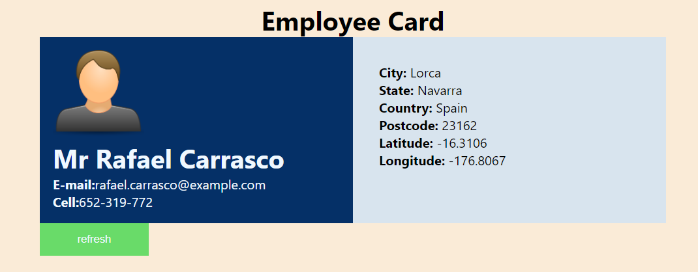
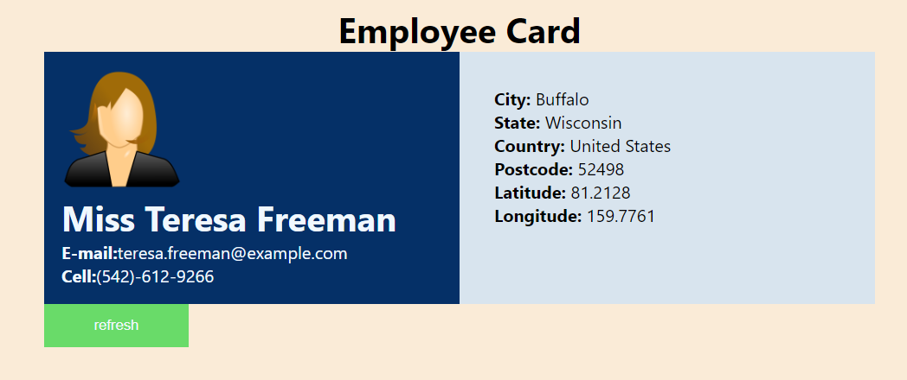

# Getting Started with Create React App

create app by running command in the terminal\
``` npx create-react-app app-name --template typescript ``` 
 
---
## import axios for fetching data from API
running command in the terminal ``` npm i axios ```

---

## Available Scripts

In the project directory, you can run:

---

### `npm start`

Runs the app in the development mode.\
Open [http://localhost:3000](http://localhost:3000) to view it in the browser.

The page will reload if you make edits.\
You will also see any lint errors in the console.\

---

## Features
-  Displays the complete name , email and address from the results of the api provided
- Fetched data will be strored to local storage
- Have a Refresh button to refresh the component (strictly
not page load) to fetch another user with the same endpoint.
- Based on the gender, the gender indentification photo will render.



